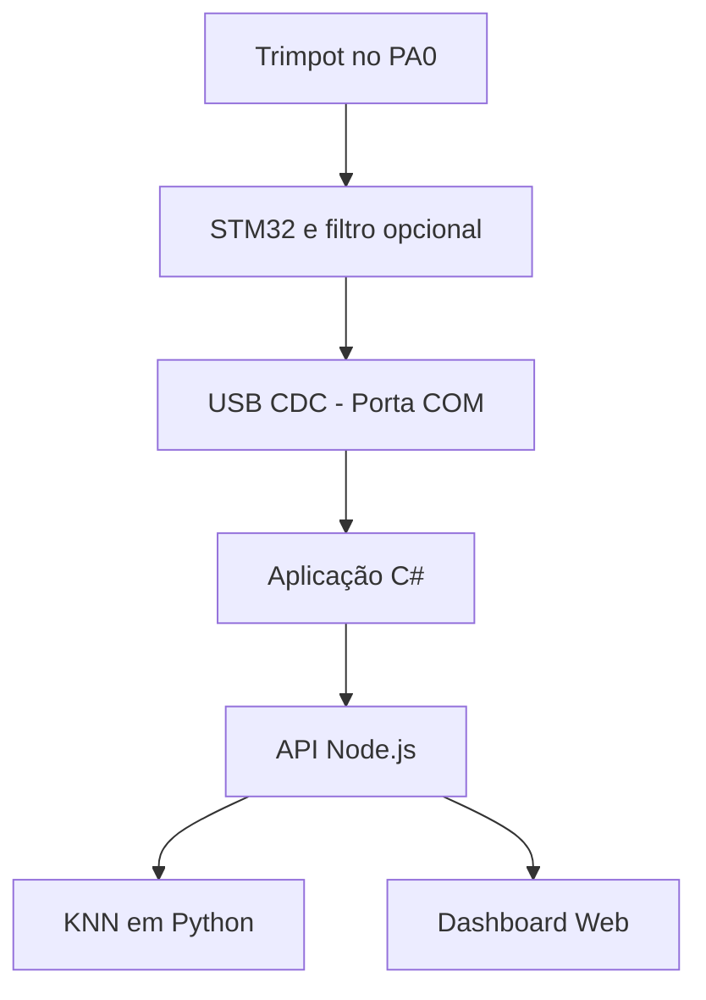

# Projeto Integrado - Monitoramento Inteligente de Luminosidade com KNN

Sistema IoT desenvolvido para aquisição, classificação e visualização de medições de luminosidade. O projeto integra STM32, uma aplicação em C#, uma API em Node.js, um classificador KNN em Python e um dashboard Web.

## Vídeo de apresentação

https://youtu.be/a3MO13_b3C0

## Integrantes

* Caio Augusto
* Pedro Otávio

## Disciplinas

* Sistemas Embarcados (SEB)
* Linguagens de Programação (LPR)
* Desenvolvimento de Aplicativos (DAPL)
* Inteligência Artificial (IA)

## Funcionamento do sistema



1. O STM32 lê pelo ADC o trimpot conectado ao pino PA0.
2. Um botão permite escolher entre o valor original e o valor tratado por um filtro passa-baixa.
3. O valor é enviado periodicamente ao computador pela USB CDC, que aparece no Windows como uma porta COM.
4. O programa em C# lê a porta serial, valida o valor, converte a medição para JSON e envia uma requisição HTTP para a API.
5. O servidor Node.js executa o classificador desenvolvido em Python.
6. O algoritmo KNN classifica a luminosidade como `Escuro`, `Adequado` ou `Muito_Iluminado`.
7. A medição e a classificação são armazenadas em JSON e exibidas no dashboard Web.

## Funcionalidades obrigatórias

* Leitura analógica do trimpot pelo ADC do STM32;
* envio periódico pela USB CDC;
* filtro passa-baixa ativado por botão GPIO;
* leitura contínua da porta COM pelo C#;
* validação e conversão da medição para JSON;
* envio HTTP para a API REST;
* classificação automática utilizando KNN;
* três categorias de luminosidade;
* exibição do valor atual, classificação e horário;
* histórico das últimas medições;
* atualização automática da interface Web;
* indicação visual do estado atual.

## Desafios extras implementados

* Gráfico com a evolução das últimas medições;
* cálculo da média, do valor máximo e do valor mínimo;
* indicação de tendência crescente, decrescente ou estável;
* alertas visuais por classificação: vermelho para `Escuro`, verde para `Adequado` e laranja para `Muito_Iluminado`.

## Estrutura do repositório

```text
Projeto_Integrado_2tri/
├── STM32/
│   ├── Core/
│   ├── Drivers/
│   ├── Middlewares/
│   ├── USB_DEVICE/
│   └── Projeto_2tri.ioc
├── Sistema/
│   ├── data/
│   ├── python/
│   ├── software/
│   ├── web/
│   ├── package.json
│   └── server.js
├── .gitignore
└── README.md
```

### Pasta `STM32`

Contém o firmware completo do STM32CubeIDE, incluindo a configuração do ADC no PA0, a USB CDC, o botão do filtro e o código de transmissão das leituras.

### Pasta `Sistema`

Contém os demais módulos:

* `software`: aplicação C# responsável pela porta COM e pelo envio HTTP;
* `python`: classificador KNN, conjunto de dados e dependências da IA;
* `web`: arquivos HTML, CSS e JavaScript do dashboard;
* `data`: configuração e histórico das medições;
* `server.js`: API REST e integração com o classificador Python.

## Tecnologias utilizadas

* STM32F103C8T6 e STM32CubeIDE;
* linguagem C e biblioteca HAL;
* USB CDC;
* C# e .NET;
* Node.js e Express;
* Python e scikit-learn;
* HTML, CSS e JavaScript;
* HTTP e JSON.

## Configuração do hardware

* Uma extremidade do trimpot deve ser ligada ao `3.3 V`;
* a outra extremidade deve ser ligada ao `GND`;
* o terminal central do trimpot deve ser ligado ao `PA0` (`ADC1_IN0`);
* a USB do STM32 deve estar conectada ao computador para a comunicação CDC.

O ADC possui resolução de 12 bits e produz valores entre `0` e `4095`.

## Pré-requisitos

* STM32CubeIDE;
* Node.js;
* Python 3 com `pip`;
* .NET SDK;
* driver da porta USB CDC reconhecido pelo Windows.

## Instalação

Abra um terminal na pasta `Sistema` e execute:

```powershell
npm install
python -m pip install -r python\requirements.txt
dotnet restore .\software\LeitorSTM32.csproj
```

## Como executar

### 1. Gravar o STM32

Abra o projeto da pasta `STM32` no STM32CubeIDE, compile e grave o firmware na placa.

### 2. Iniciar o servidor

Em um terminal aberto na pasta `Sistema`, execute:

```powershell
npm start
```

O servidor será iniciado em:

```text
http://localhost:3000
```

### 3. Iniciar a comunicação C#

Abra outro terminal na pasta `Sistema` e execute:

```powershell
dotnet run --project .\software\LeitorSTM32.csproj
```

Informe a porta do STM32 quando o programa solicitar, por exemplo `COM3`. Nenhum monitor serial, como PuTTY ou o terminal da IDE, pode estar usando a mesma porta ao mesmo tempo.

### 4. Abrir o dashboard

Acesse no navegador:

```text
http://localhost:3000
```

O dashboard não possui entrada manual. As medições exibidas são recebidas automaticamente do STM32 por meio da aplicação C#.

## API REST

| Método | Endpoint       | Função                                                    |
| ------ | -------------- | --------------------------------------------------------- |
| `GET`  | `/config`      | Retorna a configuração da quantidade de valores esperados |
| `GET`  | `/medicoes`    | Retorna o histórico de medições                           |
| `POST` | `/medicoes`    | Classifica e salva uma nova medição                       |
| `POST` | `/classificar` | Classifica uma amostra sem salvar no histórico            |

Formato enviado pelo programa C#:

```json
{
  "sample": [1500]
}
```

Exemplo de resposta:

```json
{
  "classification": "Adequado",
  "probabilities": {
    "Adequado": 1,
    "Escuro": 0,
    "Muito_Iluminado": 0
  }
}
```

## Inteligência Artificial

O arquivo `Sistema/python/dataset.csv` contém exemplos de valores classificados. O script `classify.py` treina um `KNeighborsClassifier` com três vizinhos, recebe a nova leitura, calcula a classificação e devolve a classe e as probabilidades em JSON.

## Decisões de implementação

* PA0 foi escolhido como entrada analógica por corresponder ao canal `ADC1_IN0`;
* o filtro passa-baixa suaviza oscilações do sinal e pode ser ativado pelo botão;
* cada leitura é enviada como um vetor JSON com um valor para manter compatibilidade com o modelo de IA;
* o servidor Node.js utiliza o Python como processo separado para manter os módulos organizados;
* o dashboard utiliza as últimas 20 medições nos cálculos, histórico e gráfico;
* as medições ficam registradas no arquivo `data/medicoes.json`.

## Tratamento de erros

O projeto trata situações como:

* Porta COM inexistente, ocupada ou sem resposta;
* valor serial inválido;
* servidor Node.js desligado;
* amostra JSON com formato incorreto;
* falha ao executar o classificador Python;
* resposta inválida do módulo de IA.

## Instituição

Escola Técnica de Eletrônica Francisco Moreira da Costa - ETEFMC.
